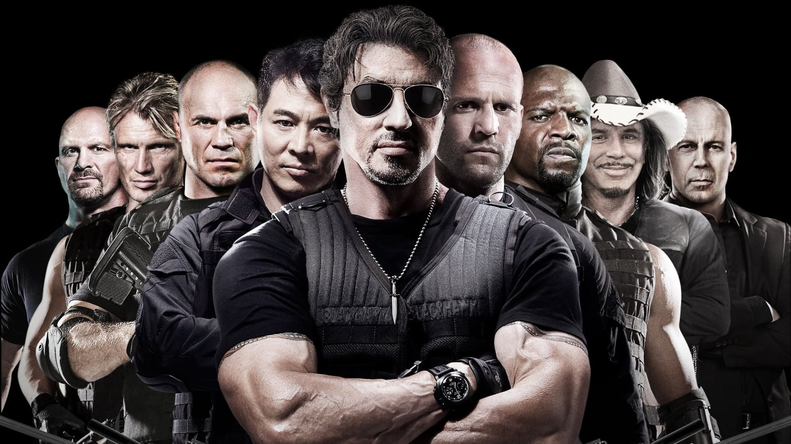
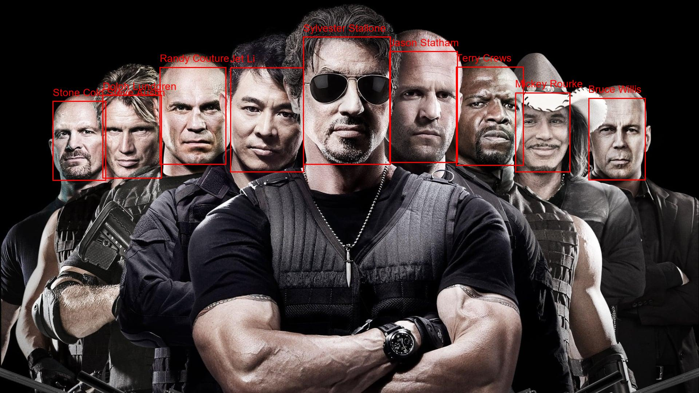

# AWS Rekognition - Detectando Celebridades em Imagens

O objetivo do projeto consistia em identificar a celebridade de uma imagem utilizando o AWS Rekognition.

Porém, novamente, para não correr o risco de ser cobrado, adaptei o projeto para adicionar um retângulo no rosto da celebridade e seu nome, utilizando um arquivo JSON adquirido de forma legal.

## Imagem original

## Resultado

